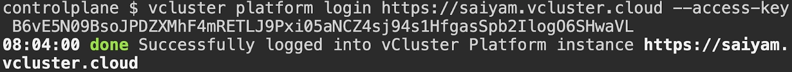
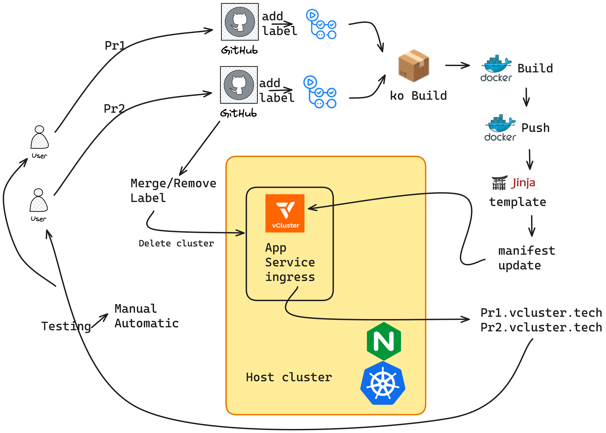
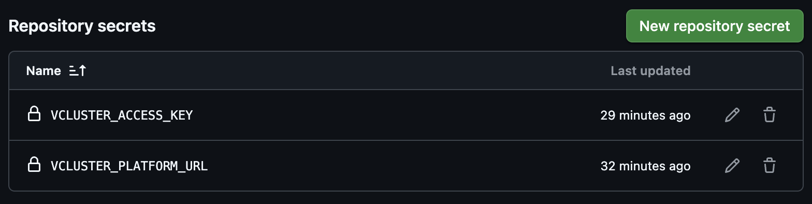
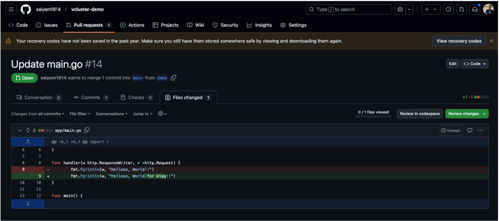
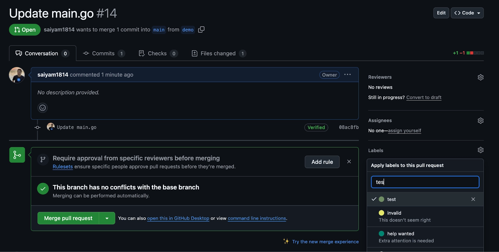
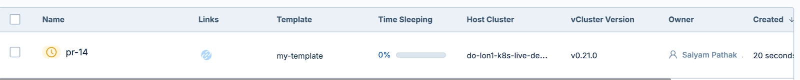
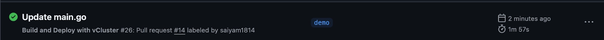
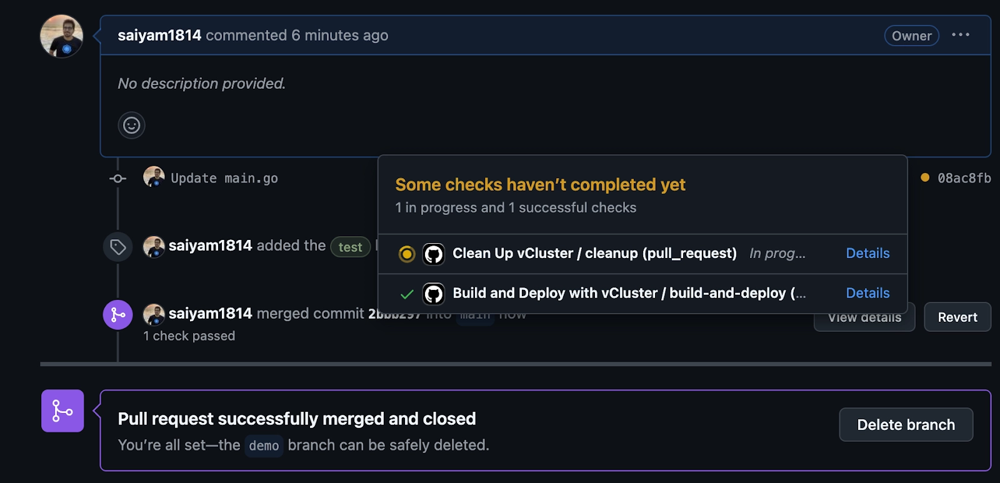

# Ephemeral PR environment using vCluster
In a fast-paced development environment, having an isolated and ephemeral environment to test changes for every pull request (PR) is a game-changer. In this blog, I’ll walk you through setting up ephemeral PR environments using vCluster, enabling seamless testing of your application in a Kubernetes environment. We'll also leverage GitHub Actions for automation, ensuring every labeled PR dynamically creates a vCluster, deploys the application, and cleans up upon merging or label removal.

Let’s dive into the step-by-step guide.

## What is vCluster?
vCluster is a technology that allows you to create lightweight, isolated Kubernetes clusters within a host cluster. These virtual clusters offer full Kubernetes functionality while being resource-efficient, making them ideal for scenarios like PR testing environments.

## Why Ephemeral PR Environments?
Ephemeral environments allow:

- Testing pull request changes in an isolated environment
- Quick validation without interfering with the main cluster
- Automatic cleanup post-testing
By leveraging vCluster and GitHub Actions, you can automate this workflow and ensure every PR gets its own dedicated environment.

## Prerequisites:
### Kubernetes cluster 
You need to have a Kubernetes cluster, in this case I am using a DigitalOcean Kubernetes cluster but any should work. I am creating a realistic production scenario so for that I used a cluster that can create service type: LoadBalancer. 

Command:
`kubectl get nodes`

```
kubectl get nodes
NAME              STATUS   ROLES    AGE   VERSION
live-demo-e0is0   Ready    <none>   19d   v1.31.1
live-demo-e0is1   Ready    <none>   19d   v1.31.1
live-demo-e0isz   Ready    <none>   19d   v1.31.1
```
### Deploying Ingress controller 
Command
```
kubectl apply -f https://raw.githubusercontent.com/kubernetes/ingress-nginx/controller-v1.9.4/deploy/static/provider/cloud/deploy.yaml

```
Output
```
kubectl get po,svc -n ingress-nginx
NAME                                           READY   STATUS      RESTARTS   AGE
pod/ingress-nginx-admission-create-lcb85       0/1     Completed   0          19d
pod/ingress-nginx-admission-patch-xl2fk        0/1     Completed   0          19d
pod/ingress-nginx-controller-79fcc99b4-7f7ls   1/1     Running     0          19d
```
Getting the LoadBalancer IP for the ingress controller:

Command:
`kubectl get svc -n ingress-nginx`
Output:
```
NAME                                         TYPE           CLUSTER-IP      EXTERNAL-IP      PORT(S)                      AGE
service/ingress-nginx-controller             LoadBalancer   10.109.28.126   209.38.160.229   80:31228/TCP,443:30435/TCP   19d
service/ingress-nginx-controller-admission   ClusterIP      10.109.15.162   <none>           443/TCP                      19d

```
Domain mapping:

For our application we need dynamic ingress for testing so what we have done here is added the loadbalancer IP of the ingress controller as the A record to the Domain. 


### Connect the Kubernetes cluster to the platform

We will enable vCluster Pro in order to use templates and create the clusters.  For simplicity, I am using my vcluster.cloud account and then creating the access key to login. In this way I don’t have to run any agent on the current cluster. You can either run vcluster platform start or sign up on vCluster cloud  and once you login, you should be able to go to access keys and create a short lived access key for the demo (remember to delete the key post demo for security reasons). 

Command:
```
vcluster platform login https://saiyam.vcluster.cloud --access-key <your-access-key>
```
Output:



Create a template under vCluster templates in the vCluster cloud platform instance.

```
sync:
  fromHost:
    ingressClasses:
      enabled: true
  toHost:
    ingresses:
      enabled: true
external:
  platform:
    autoSleep:
      afterInactivity: 3600  # Automatically sleep after 1 hour of inactivity
```
Until now we have a Kubernetes cluster with ingress controller installed and the Public IP of the nginx controller pointed to our domain. 

We also have logged into the platform using the access keys created using vcluster.cloud. Now let’s see the demo application that we have. 

## Demo Application


The scenario we are trying to achieve here involves a sample application deployed onto a Kubernetes cluster. Often, in organizations, new features or bug fixes need to be deployed and tested before being merged into the main branch. In this case, a developer raises a pull request and adds a label to test it. Based on GitHub Actions, the application is built, and then a deployment, service, and ingress Kubernetes object file are generated and pushed to a new branch. A virtual cluster is created, and the new deployment file is applied, allowing the developer to test and verify the new application deployment. 

Let’s see how this looks in practice. 
[GitHub repo](https://github.com/LoftLabs-Experiments/workshop-ephemeral-PR)
The application for this demo is a simple Go-based HTTP server:
```
package main

import (
	"embed"
	"html/template"
	"net/http"
)

//go:embed templates/*
var templatesFS embed.FS

//go:embed static/*
var staticFS embed.FS

func handler(w http.ResponseWriter, r *http.Request) {
	tmpl := template.Must(template.ParseFS(templatesFS, "templates/index.html"))
	data := struct{ Title string }{Title: "Welcome to the Multi-Tenancy March Series Powered by Loft Labs"}
	tmpl.Execute(w, data)
}

func main() {
	http.HandleFunc("/", handler)
	http.Handle("/static/", http.FileServer(http.FS(staticFS)))
	http.ListenAndServe(":8080", nil)
}

```

### Step 1: Setting Up the Deployment Template
The application is packaged as a Kubernetes deployment and exposed via a service and ingress. The deployment uses Jinja2 templating to inject dynamic values like the image tag and ingress host.

tmpl/deploy.j2:

```
kind: Deployment
metadata:
  name: workshop-app
spec:
  replicas: 1
  selector:
    matchLabels:
      app: workshop-app
  template:
    metadata:
      labels:
        app: workshop-app
    spec:
      containers:
      - name: workshop-app
        image: {{ image_deploy_tag }}
        ports:
        - containerPort: 8080
---
apiVersion: v1
kind: Service
metadata:
  name: workshop-service
spec:
  selector:
    app: workshop-app
  ports:
  - protocol: TCP
    port: 80
    targetPort: 8080
---
apiVersion: networking.k8s.io/v1
kind: Ingress
metadata:
  name: example-ingress
  namespace: default
  annotations:
    kubernetes.io/ingress.class: nginx
spec:
  ingressClassName: nginx
  rules:
  - host: {{ ingress_tag }}
    http:
      paths:
      - path: /
        pathType: Prefix
        backend:
          service:
            name: workshop-service
            port:
              number: 80
```
### Step 2: Automating with GitHub Actions
GitHub Actions handles the workflow from building the application to deploying it on a vCluster.

PR Workflow
File: .github/workflows/build-and-deploy.yml This workflow:

- Builds the application with the latest changes made by the developer using ko
- Pushes the container image to docker hub account(credentials for which should be set in the Actions secret as described previously)
- Creates a deployment manifest using Jinja2 - The action will replace the ingress host and the deployment image variables mentioned in the jinja template and then push to a new feature branch.
- Creates a vCluster.
- Deploys the application to the vCluster.
- Exposes it via ingress for testing.

```
name: Build and Deploy with vCluster

on:
  pull_request:
    types: [labeled]

jobs:
  build-and-deploy:
    if: ${{ github.event.label.name == 'test' }}
    runs-on: ubuntu-latest

    steps:
      # Step 1: Checkout the PR Code
      - name: Checkout PR Code
        uses: actions/checkout@v3
        with:
          ref: ${{ github.event.pull_request.head.sha }}

      # Step 2: Set up Go
      - name: Set up Go
        uses: actions/setup-go@v4
        with:
          go-version: '1.21'  # Matches your Dockerfile's golang:1.21-alpine

      # Step 3: Initialize Go Module
      - name: Initialize Go Module
        working-directory: app
        run: |
          go mod init github.com/loftlabs-experiments/workshop-ephemeral-pr || echo "Module already initialized"
          go mod tidy

      # Step 4: Set up ko
      - name: Set up ko
        uses: ko-build/setup-ko@v0.6
        with:
          version: v0.14.1

      # Step 5: Log into GHCR
      - name: Log into GHCR
        run: |
          echo "${{ secrets.GITHUB_TOKEN }}" | ko login ghcr.io --username ${{ github.actor }} --password-stdin

      # Step 6: Build and Push Image with ko
      - name: Build and Push Image
        working-directory: app
        env:
          KO_DOCKER_REPO: ghcr.io/loftlabs-experiments/workshop-ephemeral-pr
          KO_DEFAULT_PLATFORM: linux/amd64
        run: |
          export IMAGE_TAG=sha-$(git rev-parse --short HEAD)
          ko build . -t $IMAGE_TAG -t latest
          echo "image_deploy_tag=ghcr.io/loftlabs-experiments/workshop-ephemeral-pr:$IMAGE_TAG" >> $GITHUB_ENV

      # Step 7: Generate Deployment Manifest
      - name: Generate Deployment Manifest
        uses: cuchi/jinja2-action@v1.1.0
        with:
          template: tmpl/deploy.j2
          output_file: deploy/deployment.yaml
          strict: true
          variables: |
            image_deploy_tag=${{ env.image_deploy_tag }}
            ingress_tag=pr${{ github.event.pull_request.number }}.vcluster.tech

      # Step 8: Push to a Feature Branch
      - name: Push Deployment Manifest
        run: |
          git config --global user.email "github-actions[bot]@users.noreply.github.com"
          git config --global user.name "github-actions[bot]"
          git checkout -b feature-test-${{ github.event.pull_request.head.sha }}
          git add deploy/deployment.yaml
          git commit -m "Adding deployment.yaml for PR-${{ github.event.pull_request.number }}" || echo "No changes to commit"
          git push origin feature-test-${{ github.event.pull_request.head.sha }} --force

      # Step 9: Install vCluster CLI
      - name: Install vCluster CLI
        uses: loft-sh/setup-vcluster@main
        with:
          url: ${{ secrets.VCLUSTER_PLATFORM_URL }}
          access-key: ${{ secrets.VCLUSTER_ACCESS_KEY }}

      # Step 10: Create vCluster
      - name: Create A vCluster
        uses: loft-sh/create-vcluster@main
        with:
          name: pr-${{ github.event.pull_request.number }}
          project: default
          template: my-template
          parameters: |
            - name: ingress_link
              value: "http://pr${{ github.event.pull_request.number }}.vcluster.tech"

      # Step 11: Deploy to vCluster
      - name: Deploy Application to vCluster
        run: |
          kubectl apply -Rf deploy/

      # Step 12: Test Application with curl
      - name: Test Application
        run: |
          sleep 10  # Wait for the application to be ready
          curl --retry 5 --retry-delay 10 http://pr${{ github.event.pull_request.number }}.vcluster.tech
```
### Step 3: Cleanup Workflow
Once the PR is merged or the label is removed, the ephemeral vCluster is deleted.

File: .github/workflows/cleanup.yml
```
name: Clean Up vCluster

on:
  pull_request:
    types: [closed, unlabeled]

jobs:
  cleanup:
    if: (github.event.action == 'closed' && github.event.pull_request.merged == true) || (github.event.action == 'unlabeled' && github.event.label.name == 'test')
    runs-on: ubuntu-latest

    steps:
      # Step 1: Install vCluster CLI
      - name: Install vCluster CLI
        uses: loft-sh/setup-vcluster@main
        with:
          url: ${{ secrets.VCLUSTER_PLATFORM_URL }}
          access-key: ${{ secrets.VCLUSTER_ACCESS_KEY }}

      # Step 2: Delete vCluster
      - name: Delete vCluster
        env:
          NAME: pr-${{ github.event.pull_request.number }}
        run: |
          vcluster platform delete vcluster $NAME --project default --force || echo "vCluster $NAME not found or already deleted"
```
## How It Works

A developer creates a PR to do the feature changes.

With a small change the developer has raised a PR and now needs to add a test  label.


As soon as the label is added the GitHub actions kicks off


In the vCluster platform cloud instance you will be able to see the cluster getting created and the application will be deployed. 


The Action is completed and pr14.vcluster.tech is created as part of ingress.

The application is accessible at `http://pr<PR_NUMBER>.vcluster.tech`.

As you can see  the latest changes made by the developer are deployed. 


### Cleanup:

Upon PR merge or label removal, the ephemeral vCluster is automatically deleted.


After merging, the cleanup action is triggered, which will clear the virtual cluster.

## Conclusion
Ephemeral PR environments using vCluster simplify testing, reduce resource usage, and provide a seamless developer experience. By combining vCluster with GitHub Actions, you can achieve an automated and efficient workflow for testing PRs.